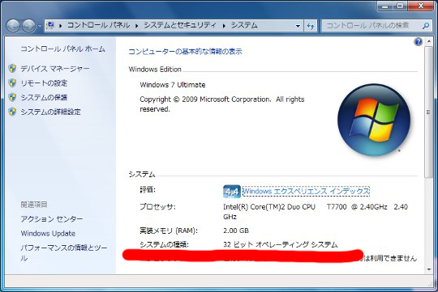
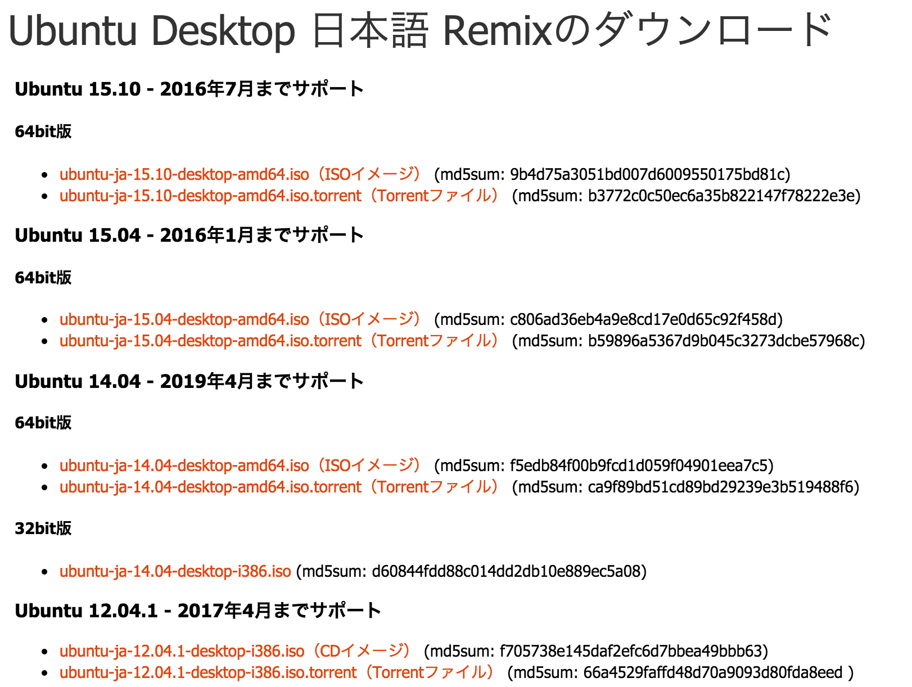

## CAR crash course

CAR(Computer-assisted reporting)の体験コース(crash course)を開きます。

地価公示を素材に、オープンソースのソフトウエア(OSS)だけを使ってデータを閲覧します。作業に必要な基本スキルとして、表計算ソフト、GIS、シェルスクリプト、R(統計ソフト)、Python（pandas）などを体験します。

各領域だけで、入門本・マニュアルが何冊もある基本的かつ多機能な技術です。「それを学んで何が出来るようになるか」が垣間見れるように企画しました。（私もどこまで多機能なのか把握していませんし、現在も新機能が追加され続けています）

どなたでも参加していただいて構いませんが、特にNICARデンバー大会に参加を検討されている方のsession選択の参考になるように、「データの入手・分析側」に絞っています。参加されない方にも「こんなことを記者が学んでいるんだ」という感触が得られるようにしました。

NICAR2016予定セッション: <https://www.ire.org/conferences/nicar2016/expected-sessions/>

* 場所：プレスセンタービル
* 日時：2月13日12時~(予定)
* 持ち物：WindowsかMacのノートパソコン（ディスクに最低限10-20GB程度の余裕が必要です）
* 予定：12-13時　OSSソフトのインストール（オプション）
* 　　　13-15時　公示地価データの分析体験
* 　　　15-16時　TSUTAYAの商圏・肝疾患死の分布の分析デモ
* 　　　長丁場なので途中で抜けていただいて構いません

### OSSソフトのインストールについて

Windows/Macで同じ作業環境をつくるため、仮想化ソフトのvirtualBox上でLinux(Ubuntu)を使って説明します。

NICAR前日(9日)に開かれる特別トレーニングBootstraping the Newsを真似ています。
自分でインストールできる方は13時から参加してください。

#### インストール手順

* セキュリティの厳しい社内LANだとアップデートに失敗する可能性があります。
* virtualBox <https://www.virtualbox.org/> から対応ファイルをダウンロードする。
* Ubuntu日本語Remixイメージ <https://www.ubuntulinux.jp/japanese> をダウンロードする。
  * Windowsの場合、「コントロールパネル」の「システム」を見て、32bitか64bitか確認する。
  
  * Windows32bitの場合、Ubuntu 14.04の32bit版isoファイルをダウンロードする。
  * Windows64bit/MacOSの場合、最新の64bit版isoファイルをダウンロードする。
  
* Windowsの場合
  * virtualBoxのインストーラーをクリックして、インストールする。
    * 「ネットワークが一時的に切断されます」と警告されます（無視します）
    * Oracleのドライバ（デバイスソフトウエア）を全てインストールします。
  * 「新規」を選び、Ubuntuのインストールを開始する。（10-30分かかります）
    * 名前：Ubuntu(自由です)、タイプ：Linux、バージョン：Linux
    * メモリーサイズは1000MB以上がおすすめ。
    * 仮想ハードディスクにあるストレージは固定サイズにし、10GB-30GB程度を確保する。
    * その他の設定はデフォルト。
  * 「起動」を選び、Ubuntuのisoイメージを指定するとインストールが始まる（ユーザー名などを適宜入力する）。
  * 最後に再起動するが、停止する場合はMachine(マシン)▶︎Reset（リセット）をかけて強制再起動する。
  * Ubuntu再起動後、virtualBoxのDevices▶︎Insert Guest Additions CD Image(Guest addition CDイメージ挿入)を実行する（これにより、画面サイズが自動になる）。
  * 再びUbuntuをシャットダウンし、VirtualBoxの設定▶︎一般▶︎高度でクリップボードとドラッグ＆ドロップを「双方向」にする。
* Macの場合
  * virtualBoxのインストーラーをクリックして、インストールする。
  * 「新規」を選び、Ubuntuのインストールを開始する。（10-30分かかります）
    * メモリーサイズは1000MB以上がおすすめ。
    * 仮想ハードディスクにあるストレージは固定サイズにし、10GB-30GB程度を確保する。
    * その他の設定はデフォルト。
  * 「起動」を選び、Ubuntuのisoイメージを指定するとインストールが始まる（ユーザー名などを適宜入力する）。
  * 最後に再起動するが、停止する場合はMachine▶︎Resetをかけて強制再起動する。
  * Ubuntu再起動後、virtualBoxのDevices▶︎Insert Guest Additions CD Imageを実行する（これにより、画面サイズが自動になる）。
  * 再びUbuntuをシャットダウンし、VirtualBoxの設定▶︎一般▶︎高度でクリップボードとドラッグ＆ドロップを「双方向」にする。

ここで、Windows/Mac上のファイルをUbuntuのデスクトップにドラック＆ドロップできるか、確認してみる。

最後に、Ubuntu上で「端末」を開き、ソフトウエアをインストールする。
::

	>>> sudo apt-get upgrade
	>>> sudo apt-get update             # apt-cache search/show <アプリ名>で探す
	>>> sudo apt-get install r-base
	>>> sudo apt-get install r-cran-*   # スキップしてもよい
	>>> R (大文字のRで起動)
	>>> sudo apt-get install qgis
	>>> qgis (起動)
	>>> sudo apt-get install python-pandas
	>>> sudo apt-get install mysql-server　#今回はスキップ（rootのパスワードは今回は空欄。３回）
